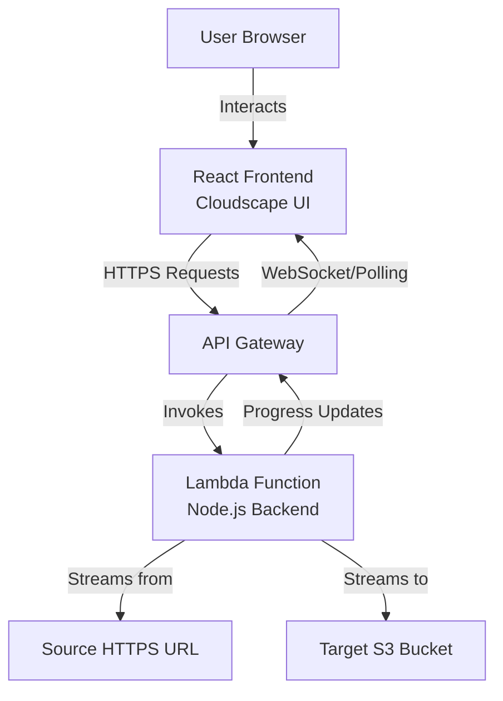

# Design Document: S3 ZIP Downloader

## Overview

The S3 ZIP Downloader is a cloud-based web application that enables users to transfer ZIP files directly from HTTPS URLs to AWS S3 buckets without downloading files to their local machine. The application consists of a React-based frontend using AWS Cloudscape Design System and a Node.js backend service that handles the streaming transfer between the source URL and S3.

The architecture follows a client-server model where the frontend provides input validation and progress visualization, while the backend handles authentication, streaming, and S3 operations. The application will be deployed using AWS services: the frontend on S3 + CloudFront, and the backend on AWS Lambda with API Gateway.

## Architecture

### High-Level Architecture



### Technology Stack

**Frontend:**
- React 18+ with TypeScript
- AWS Cloudscape Design System for UI components
- Axios for HTTP requests
- Deployed on S3 + CloudFront

**Backend:**
- Node.js 18+ with TypeScript
- AWS SDK v3 for S3 operations
- Express.js for API routing (if using containerized deployment)
- Deployed on AWS Lambda + API Gateway

**Infrastructure:**
- AWS CDK for infrastructure-as-code
- CloudFormation for deployment
- IAM roles for secure AWS access

### Deployment Architecture

The application will use a serverless architecture for cost-efficiency and scalability:

1. **Frontend**: Static files hosted on S3, distributed via CloudFront
2. **Backend**: Lambda function behind API Gateway
3. **Authentication**: IAM role attached to Lambda with S3 write permissions
4. **Progress Updates**: Long-polling or WebSocket API for real-time updates

## Components and Interfaces

### Frontend Components

#### 1. App Component
- Root component managing application state
- Handles routing (if multi-page)
- Provides global error boundary

#### 2. DownloadForm Component
- Renders input fields for source URL and S3 bucket
- Performs client-side validation
- Manages form state and submission
- Displays validation errors

**Props:**
```typescript
interface DownloadFormProps {
  onSubmit: (request: DownloadRequest) => Promise<void>;
  isLoading: boolean;
}
```

**State:**
```typescript
interface DownloadFormState {
  sourceUrl: string;
  bucketName: string;
  keyPrefix: string;
  errors: ValidationErrors;
}
```

#### 3. ProgressBar Component
- Displays transfer progress
- Shows percentage complete
- Renders success/error messages
- Uses Cloudscape ProgressBar component

**Props:**
```typescript
interface ProgressBarProps {
  progress: number; // 0-100
  status: 'idle' | 'in-progress' | 'success' | 'error';
  message?: string;
  s3Location?: string;
}
```

#### 4. ValidationService
- Validates HTTPS URLs
- Validates .zip extension
- Validates S3 bucket naming conventions
- Returns structured error messages

**Interface:**
```typescript
interface ValidationService {
  validateUrl(url: string): ValidationResult;
  validateBucketName(bucket: string): ValidationResult;
  validateKeyPrefix(prefix: string): ValidationResult;
}

interface ValidationResult {
  isValid: boolean;
  error?: string;
}
```

### Backend Components

#### 1. API Handler (Lambda Entry Point)
- Receives download requests from API Gateway
- Validates request payload
- Initiates streaming transfer
- Returns progress updates

**Request Interface:**
```typescript
interface DownloadRequest {
  sourceUrl: string;
  bucketName: string;
  keyPrefix?: string;
}
```

**Response Interface:**
```typescript
interface DownloadResponse {
  success: boolean;
  s3Location?: string;
  error?: string;
  transferId?: string;
}
```

#### 2. StreamingService
- Fetches file from source URL using streaming
- Pipes data to S3 using multipart upload
- Tracks bytes transferred for progress
- Handles network errors and retries

**Interface:**
```typescript
interface StreamingService {
  transferToS3(
    sourceUrl: string,
    bucket: string,
    key: string,
    onProgress: ProgressCallback
  ): Promise<TransferResult>;
}

type ProgressCallback = (bytesTransferred: number, totalBytes: number) => void;

interface TransferResult {
  success: boolean;
  s3Location?: string;
  error?: Error;
  bytesTransferred: number;
}
```

#### 3. S3Service
- Wraps AWS SDK S3 client
- Validates bucket permissions before transfer
- Creates multipart upload
- Handles upload parts and completion

**Interface:**
```typescript
interface S3Service {
  validateBucketAccess(bucket: string): Promise<boolean>;
  createMultipartUpload(bucket: string, key: string): Promise<string>;
  uploadPart(uploadId: string, partNumber: number, data: Buffer): Promise<string>;
  completeUpload(uploadId: string, parts: CompletedPart[]): Promise<string>;
  abortUpload(uploadId: string): Promise<void>;
}
```

#### 4. UrlService
- Extracts filename from URL
- Validates URL accessibility
- Retrieves content-length header for progress tracking

**Interface:**
```typescript
interface UrlService {
  extractFilename(url: string): string;
  getContentLength(url: string): Promise<number>;
  validateUrlAccessible(url: string): Promise<boolean>;
}
```

## Data Models

### DownloadRequest
```typescript
interface DownloadRequest {
  sourceUrl: string;        // HTTPS URL to ZIP file
  bucketName: string;       // Target S3 bucket name
  keyPrefix?: string;       // Optional S3 key prefix (folder path)
}
```

### TransferProgress
```typescript
interface TransferProgress {
  transferId: string;
  bytesTransferred: number;
  totalBytes: number;
  percentage: number;       // 0-100
  status: TransferStatus;
  startTime: Date;
  endTime?: Date;
  error?: string;
}

enum TransferStatus {
  PENDING = 'pending',
  IN_PROGRESS = 'in-progress',
  COMPLETED = 'completed',
  FAILED = 'failed'
}
```

### S3Location
```typescript
interface S3Location {
  bucket: string;
  key: string;
  region: string;
  url: string;              // s3:// URL
  consoleUrl: string;       // AWS Console URL
}
```

### ValidationError
```typescript
interface ValidationError {
  field: string;
  message: string;
  code: ValidationErrorCode;
}

enum ValidationErrorCode {
  INVALID_URL = 'invalid_url',
  INVALID_PROTOCOL = 'invalid_protocol',
  INVALID_EXTENSION = 'invalid_extension',
  INVALID_BUCKET_NAME = 'invalid_bucket_name',
  INVALID_KEY_PREFIX = 'invalid_key_prefix'
}
```


## Correctness Properties

*A property is a characteristic or behavior that should hold true across all valid executions of a system—essentially, a formal statement about what the system should do. Properties serve as the bridge between human-readable specifications and machine-verifiable correctness guarantees.*

### Property 1: HTTPS Protocol Validation
*For any* URL string, the validation function should return true only if the URL uses the HTTPS protocol.
**Validates: Requirements 1.2**

### Property 2: ZIP Extension Validation
*For any* URL string, the validation function should return true only if the URL ends with the .zip extension.
**Validates: Requirements 1.3**

### Property 3: Invalid URL Error Display
*For any* invalid URL input, the Web Application should display an error message describing the validation failure.
**Validates: Requirements 1.4**

### Property 4: Valid URL Enables Action
*For any* valid URL input (HTTPS with .zip extension), the download button should transition from disabled to enabled state.
**Validates: Requirements 1.5**

### Property 5: S3 Bucket Name Validation
*For any* bucket name string, the validation function should return true only if the name follows AWS S3 naming conventions (3-63 characters, lowercase letters, numbers, hyphens, dots, no uppercase, no underscores, no adjacent periods, no IP address format).
**Validates: Requirements 2.2**

### Property 6: Invalid Bucket Name Error Display
*For any* invalid bucket name input, the Web Application should display an error message describing the validation failure.
**Validates: Requirements 2.3**

### Property 7: Valid Bucket Name Enables Action
*For any* valid bucket name input, when combined with a valid URL, the download button should be enabled.
**Validates: Requirements 2.4**

### Property 8: Key Prefix Incorporation
*For any* optional key prefix provided, the final S3 object key should be the concatenation of the prefix and the extracted filename.
**Validates: Requirements 2.5**

### Property 9: Fetch Initiation
*For any* valid download request, the Backend Service should initiate an HTTP GET request to the source URL.
**Validates: Requirements 3.1**

### Property 10: Streaming Transfer (Memory Efficiency)
*For any* file transfer, the Backend Service's memory usage should remain constant regardless of file size, indicating streaming behavior rather than buffering.
**Validates: Requirements 3.2**

### Property 11: Filename Extraction
*For any* source URL, the Backend Service should extract the filename from the URL path and use it as the S3 object key (or append it to the key prefix if provided).
**Validates: Requirements 3.3**

### Property 12: Connection Error Handling
*For any* unreachable or invalid source URL, the Backend Service should return an error response to the Web Application without crashing.
**Validates: Requirements 3.4**

### Property 13: S3 Write Error Handling
*For any* S3 write failure (permissions, bucket doesn't exist, etc.), the Backend Service should return an error response to the Web Application.
**Validates: Requirements 3.5**

### Property 14: Progress Bar Display
*For any* in-progress file transfer, the Web Application should display a progress bar component with a percentage value between 0 and 100.
**Validates: Requirements 4.1**

### Property 15: Progress Reporting
*For any* data chunk received from the source URL, the Backend Service should emit a progress update event.
**Validates: Requirements 4.2**

### Property 16: Progress Bar Updates
*For any* progress update received, the Web Application should update the progress bar's displayed percentage.
**Validates: Requirements 4.3**

### Property 17: Success Message Display
*For any* successfully completed transfer, the Web Application should display a success message containing the S3 location (bucket and key).
**Validates: Requirements 4.4**

### Property 18: Failure Message Display
*For any* failed transfer, the Web Application should display an error message with details about the failure.
**Validates: Requirements 4.5**

### Property 19: Permission Validation
*For any* S3 bucket specified, the Backend Service should validate write permissions before initiating the file transfer.
**Validates: Requirements 6.2**

### Property 20: Permission Error Handling
*For any* bucket where the Backend Service lacks write permissions, the service should return a clear error message indicating insufficient permissions.
**Validates: Requirements 6.3**

### Property 21: Streaming Memory Consistency
*For any* file of any size up to 5GB, the Backend Service should maintain consistent memory usage throughout the transfer, proving streaming implementation.
**Validates: Requirements 8.1**

### Property 22: Large File Timeout Handling
*For any* file transfer that takes longer than typical timeout periods, the Backend Service should maintain the connection without timing out prematurely.
**Validates: Requirements 8.2**

### Property 23: Network Interruption Handling
*For any* network interruption during transfer, the Backend Service should detect the interruption and handle it gracefully without crashing.
**Validates: Requirements 8.3**

### Property 24: Interruption Error Reporting
*For any* interrupted transfer, the Backend Service should send an error response to the Web Application indicating the interruption.
**Validates: Requirements 8.4**

## Error Handling

### Frontend Error Handling

1. **Validation Errors**: Display inline error messages below input fields using Cloudscape FormField error text
2. **Network Errors**: Display flash messages using Cloudscape Flashbar component
3. **Transfer Errors**: Display error state in progress component with retry option
4. **Timeout Errors**: Display timeout message with option to retry

### Backend Error Handling

1. **URL Fetch Errors**:
   - DNS resolution failures → "Unable to resolve URL"
   - Connection timeout → "Connection to source URL timed out"
   - HTTP errors (404, 403, etc.) → "Source file not accessible: HTTP {code}"
   - SSL/TLS errors → "Secure connection failed"

2. **S3 Errors**:
   - Bucket not found → "S3 bucket '{bucket}' does not exist"
   - Access denied → "Insufficient permissions to write to bucket '{bucket}'"
   - Quota exceeded → "S3 storage quota exceeded"
   - Network errors → "Failed to upload to S3: network error"

3. **Streaming Errors**:
   - Incomplete transfer → "Transfer interrupted: {bytes} of {total} bytes transferred"
   - Multipart upload failure → "Upload failed during part {partNumber}"
   - Checksum mismatch → "Data integrity check failed"

4. **Resource Errors**:
   - Lambda timeout → "Transfer exceeded maximum execution time"
   - Memory limit → "Insufficient memory for transfer operation"

### Error Response Format

```typescript
interface ErrorResponse {
  success: false;
  error: {
    code: string;
    message: string;
    details?: Record<string, any>;
    retryable: boolean;
  };
}
```

## Testing Strategy

### Unit Testing

The application will use **Jest** as the testing framework for both frontend and backend unit tests.

**Frontend Unit Tests:**
- Validation functions (URL, bucket name, key prefix)
- Component rendering (form inputs, progress bar, error messages)
- State management logic
- Error message formatting

**Backend Unit Tests:**
- URL parsing and filename extraction
- S3 service methods (mocked AWS SDK)
- Error handling logic
- Request/response formatting

### Property-Based Testing

The application will use **fast-check** (JavaScript/TypeScript property-based testing library) to verify universal properties.

**Configuration:**
- Each property-based test will run a minimum of 100 iterations
- Tests will use custom generators for URLs, bucket names, and file sizes
- Each test will be tagged with a comment referencing the design document property

**Property Test Coverage:**
- URL validation properties (Properties 1-4)
- Bucket name validation properties (Properties 5-7)
- Filename extraction property (Property 11)
- Error handling properties (Properties 12-13, 18, 20, 23-24)
- Progress reporting properties (Properties 14-16)
- Memory efficiency property (Property 21)

**Tag Format:**
Each property-based test will include a comment:
```typescript
// Feature: s3-zip-downloader, Property 1: HTTPS Protocol Validation
```

### Integration Testing

- End-to-end tests using a test S3 bucket
- Mock HTTP server for source URL testing
- Test actual streaming behavior with various file sizes
- Test progress reporting with real transfers

### Manual Testing

- Visual verification of AWS Console styling
- Responsive design testing on multiple devices
- Accessibility testing
- Performance testing with large files

## Deployment Strategy

### Infrastructure Components

**AWS CDK Stack:**
```typescript
- S3 Bucket (Frontend hosting)
- CloudFront Distribution (CDN)
- Lambda Function (Backend)
- API Gateway (REST API)
- IAM Role (Lambda execution role with S3 permissions)
- CloudWatch Logs (Logging)
```

### Deployment Steps

1. **Build Frontend**:
   - Run `npm run build` to create production bundle
   - Output to `dist/` directory

2. **Deploy Infrastructure**:
   - Run `cdk deploy` to create/update AWS resources
   - CDK will create CloudFormation stack

3. **Upload Frontend**:
   - Sync `dist/` to S3 bucket
   - Invalidate CloudFront cache

4. **Deploy Backend**:
   - Package Lambda function with dependencies
   - Upload to Lambda via CDK
   - Configure environment variables (region, etc.)

### Environment Variables

**Backend Lambda:**
```
AWS_REGION=us-east-1
MAX_FILE_SIZE=5368709120  # 5GB in bytes
TIMEOUT_SECONDS=900       # 15 minutes
```

### IAM Permissions

**Lambda Execution Role:**
```json
{
  "Version": "2012-10-17",
  "Statement": [
    {
      "Effect": "Allow",
      "Action": [
        "s3:PutObject",
        "s3:PutObjectAcl",
        "s3:AbortMultipartUpload",
        "s3:ListMultipartUploadParts"
      ],
      "Resource": "arn:aws:s3:::*/*"
    },
    {
      "Effect": "Allow",
      "Action": [
        "s3:ListBucket",
        "s3:GetBucketLocation"
      ],
      "Resource": "arn:aws:s3:::*"
    },
    {
      "Effect": "Allow",
      "Action": [
        "logs:CreateLogGroup",
        "logs:CreateLogStream",
        "logs:PutLogEvents"
      ],
      "Resource": "arn:aws:logs:*:*:*"
    }
  ]
}
```

### Monitoring and Logging

- CloudWatch Logs for Lambda execution logs
- CloudWatch Metrics for transfer success/failure rates
- X-Ray tracing for performance analysis
- CloudFront access logs for frontend usage

## Security Considerations

1. **Credential Management**: AWS credentials never exposed to frontend; Lambda uses IAM role
2. **Input Validation**: All user inputs validated on both frontend and backend
3. **HTTPS Only**: Application only accepts HTTPS URLs for source files
4. **CORS Configuration**: API Gateway configured with appropriate CORS headers
5. **Rate Limiting**: API Gateway throttling to prevent abuse
6. **Content Type Validation**: Verify Content-Type header from source URL
7. **Size Limits**: Enforce maximum file size (5GB) to prevent resource exhaustion

## Performance Considerations

1. **Streaming**: Use Node.js streams to handle large files without memory issues
2. **Multipart Upload**: Use S3 multipart upload for files over 100MB
3. **Progress Throttling**: Limit progress updates to every 1% or 1MB to reduce overhead
4. **Connection Pooling**: Reuse HTTP connections for efficiency
5. **Lambda Memory**: Allocate 1024MB memory for Lambda to handle streaming efficiently
6. **Timeout Configuration**: Set Lambda timeout to 15 minutes for large files

## Future Enhancements

1. **Batch Transfers**: Support multiple URLs in a single request
2. **Resume Capability**: Support resuming interrupted transfers
3. **File Validation**: Verify ZIP file integrity after transfer
4. **Authentication**: Add user authentication for access control
5. **Transfer History**: Store and display past transfers
6. **Notifications**: Email/SNS notifications on transfer completion
7. **Scheduling**: Schedule transfers for later execution
8. **Bandwidth Limiting**: Control transfer speed to manage costs
